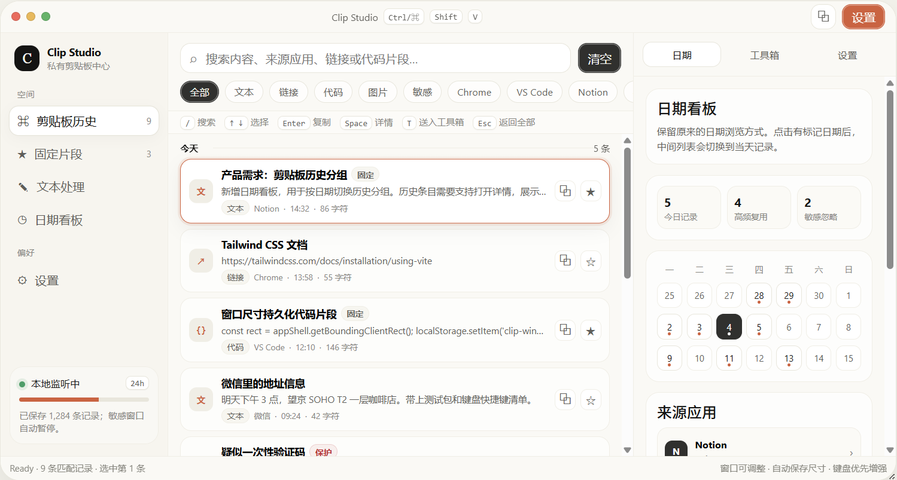
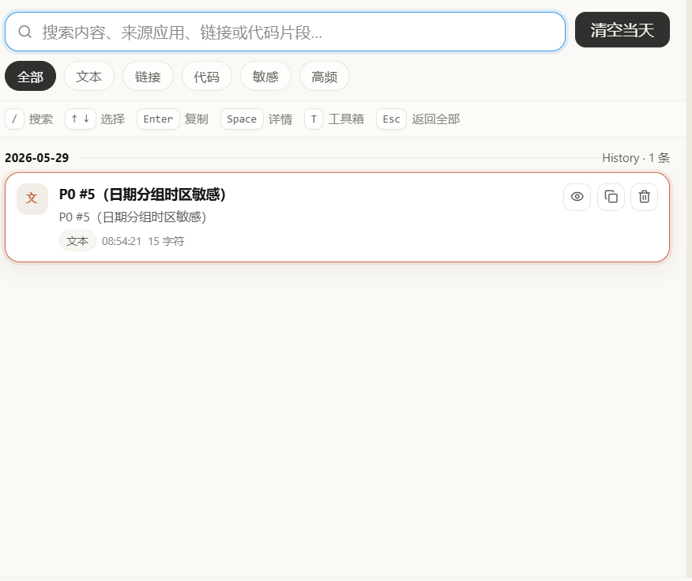
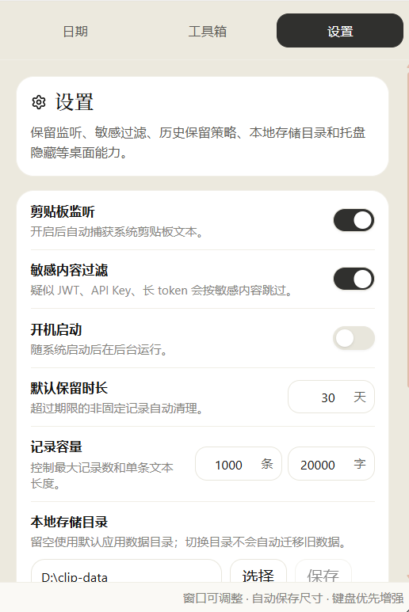

# Clip Studio

> 基于 Tauri 2 + React 19 的本地桌面剪贴板工具箱。自动捕获文本剪贴板，按日期归档，支持搜索、回拷与软删除——全本地存储，不依赖云端。

**版本**：0.4.0  ·  **平台**：Windows 10/11（macOS / Linux 在路线图中）

---

## English Brief

Clip Studio is a local-first desktop clipboard manager built with Tauri 2 and React 19. It silently captures the text you copy, deduplicates via content hash, organizes records by date, and lets you search across history and re-copy at any time. All data stays on disk—no cloud, no telemetry, no network calls.

Highlights:

- Text clipboard auto-capture with content-hash dedup
- Date-grouped sidebar with cross-date search
- System tray, autostart, native menus, hide-to-tray
- Retention policy by days and record count, plus per-record length cap
- Sensitive content filter with built-in heuristics and user-supplied regex
- Custom local SQLite storage directory; soft delete + manual purge with `VACUUM`

---

## 项目简介

Clip Studio 面向开发、写作与资料整理场景，把你复制过的文本默默存下来，避免「刚才那段又被覆盖了」的尴尬。所有数据持久化到本地 SQLite，不上传，不同步，不调用外部网络。

应用以系统托盘形式常驻，支持开机自启与窗口隐藏。主窗口三栏布局：日期侧栏 / 记录列表 / 详情面板，配合顶部搜索可跨日检索。重复内容只会增加计数而非占位，长内容与疑似敏感内容会被跳过并给出原因。

## 功能亮点

- **自动采集**：文本剪贴板轮询监听，内容哈希去重，重复内容更新计数而非新增记录
- **日期归档**：按本地日期分组的侧栏，今天 / 昨天 / 历史日期一键切换
- **跨日搜索**：基于内容与摘要的 `LIKE` 检索（FTS5 列入路线图）
- **桌面集成**：系统托盘、隐藏/显示主窗口、开机启动、原生「系统」/「设置」菜单
- **保留策略**：按天数 + 按记录数双轨清理，每 50 次写入触发一次清理避免抖动
- **敏感过滤**：内置 JWT / API key 启发式规则，支持自定义正则
- **存储自定义**：可指定本地 SQLite 存储目录，附路径可写校验
- **数据维护**：软删除保留误删窗口，提供物理清理 + SQLite `VACUUM`

## 截图

> 截图占位，待后续 PR 补图替换。

| 主视图 | 搜索 | 设置 |
|---|---|---|
|  |  |  |

## 技术栈

- **前端**：React 19 + TypeScript 5.8 + Tailwind CSS 4 + Vite 7
- **桌面外壳**：Tauri 2
- **后端**：Rust 2021 + rusqlite (bundled) + arboard + chrono + sha2 + regex
- **打包**：NSIS（Windows）

详细依赖见 `package.json` 与 `src-tauri/Cargo.toml`。

## 快速开始

### 环境要求

- Node.js 20+ 与 pnpm 9+
- Rust stable toolchain（1.77+）+ MSVC build tools（Windows）
- Windows 10/11；macOS / Linux 暂未提供官方构建，可参考 Tauri 文档自行配置

### 本地开发

```bash
pnpm install
pnpm tauri:dev
```

`pnpm tauri:dev` 会启动 Vite dev server 并打开 Tauri 调试窗口。仅前端开发可单独 `pnpm dev`。

### 生产构建

```bash
pnpm tauri build
```

构建产物位于 `src-tauri/target/release/bundle/nsis/`。

### 后端测试

```bash
cd src-tauri
cargo test clipboard
```

## 项目结构

```
src/                  前端 React 代码
  components/         UI 组件（侧栏 / 列表 / 详情 / 设置浮层）
  hooks/              交互状态 hooks
  api/                Tauri invoke 包装
  types/              共享类型
src-tauri/src/        Rust 后端
  clipboard/          剪贴板服务、数据库、设置、监听
  desktop.rs          托盘、菜单、窗口控制
  lib.rs              入口
docs/                 设计文档、审查清单、follow-up
  superpowers/        子项目 spec / plan
```

## 配置说明

应用首次启动会在系统应用数据目录创建 SQLite 数据库与配置表。打开「设置」浮层（原生菜单或 UI 按钮）可调整：

- **监听开关**：暂停采集，便于输入敏感信息
- **开机启动**：通过 Tauri autostart 插件管理
- **保留天数 / 最大记录数 / 单条文本上限**：控制存储增长
- **敏感内容过滤**：开启后跳过疑似 JWT / API key 内容；可叠加自定义正则
- **自定义存储目录**：指向其它本地 SQLite 文件位置，附可写校验

更详细的字段语义见 `docs/clipboard-toolbox-design.md` 第 7、11 节。

## 路线图与已交付

详细规划见 `docs/clipboard-toolbox-design.md`。当前进度：

- [x] **M1 基础闭环**：采集 / 去重 / 按日期查询 / 详情 / 复制 / 软删除
- [x] **M2 体验完善**：搜索 / 清空当日 / 空与加载状态 / 重复计数
- [x] **M3 桌面增强**：系统托盘 / 开机启动 / 原生菜单 / 隐藏到托盘
- [x] **P1 可靠性**：监听状态持久化 / 目录选择校验 / 跳过原因反馈 / 连接复用 / 保留策略触发收敛
- [x] **P2 维护能力**：菜单语义 / 物理清理 + VACUUM / 自定义敏感正则
- [ ] **未来**：图片 / 文件 / 富文本剪贴板、收藏与标签、全局快捷键、导入导出、macOS / Linux 打包

未收口的优化项见 `docs/2026-05-28-clipboard-toolbox-audit.md`，本轮 follow-up 项见 `docs/2026-05-29-connection-pool-followups.md`。

## 开发文档

- 设计文档：`docs/clipboard-toolbox-design.md`
- 审查清单（22 项）：`docs/2026-05-28-clipboard-toolbox-audit.md`
- 子项目 spec / plan：`docs/superpowers/specs/`、`docs/superpowers/plans/`
- Follow-up：`docs/2026-05-29-connection-pool-followups.md`

---

> 内部项目，当前未公开授权。
